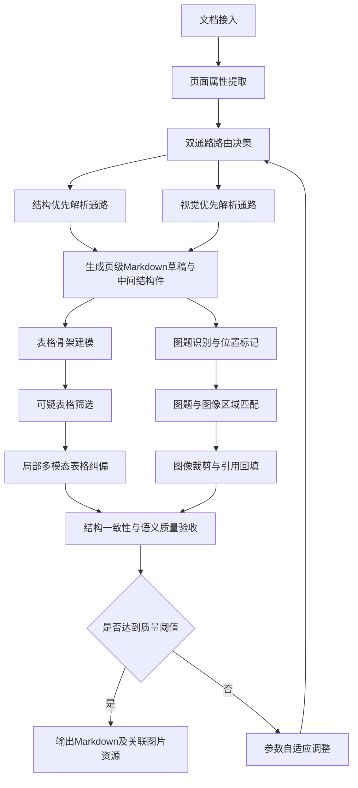
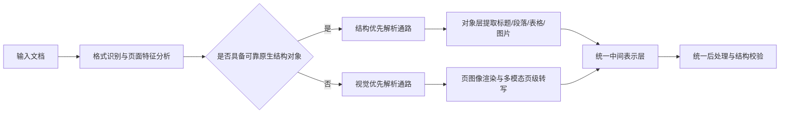
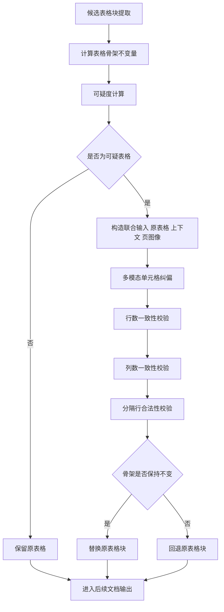
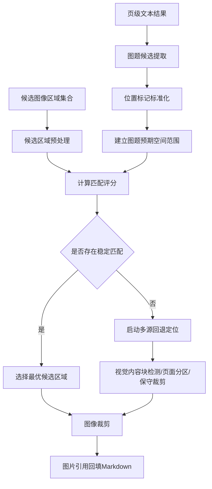
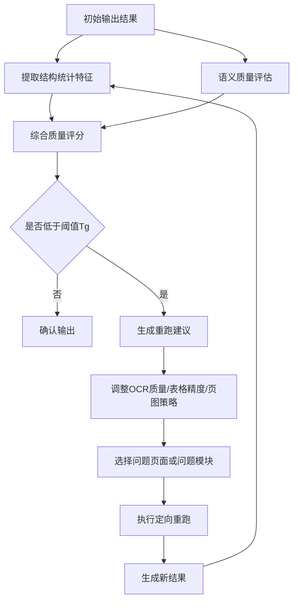

# 发明名称

一种面向水利工程复杂文档的多模态结构约束转换方法、系统、设备及存储介质

# 摘要

本发明涉及智能文档处理与工程资料数字化技术领域，公开了一种面向水利工程复杂文档的多模态结构约束转换方法、系统、设备及存储介质。针对水利行业设计说明、施工记录、巡检台账、验收资料、历史扫描档案等文档中存在的宽表、勾选表、工程图、曲线图、多图同页、扫描失真以及图文混排等问题，提出一种双通路协同解析与结构保真转换方案。该方案首先基于文档类型、版式特征及页面属性，在结构优先解析通路与视觉优先解析通路之间进行自适应路由；随后构建页级 Markdown 草稿、中间表格块、图题候选及图像候选区域；再基于表格骨架不变量和可疑表格检测策略，对高风险表格局部触发多模态纠偏；同时通过图题位置标记、候选图框评分、表格区域避让和多源回退定位机制，实现图题与图像区域的稳定绑定和裁剪；其后结合结构统计特征、图片引用一致性、表格合法性及语义质量评分，执行质量验收并驱动参数自适应重跑；最终输出满足结构保真要求的 Markdown 文档及关联图片资源。本发明不是对现有 OCR、版面模型和大模型的简单串联，而是通过结构骨架约束、图表语义分离、局部复核、质量闭环和自动回退等原创机制，实现了水利工程复杂文档的高可靠结构化转写，适用于工程档案治理、知识库建设、智能检索和后续数据抽取等场景。

# 权利要求书

## 1. 一种面向水利工程复杂文档的多模态结构约束转换方法

其特征在于，包括如下步骤：

1. 获取待转换文档，并提取文档格式、页数、页面图像特征、是否扫描页、是否包含候选表格区域、是否包含候选图像区域中的至少一种页面属性；
2. 基于所述页面属性，在结构优先解析通路与视觉优先解析通路之间执行自适应路径选择，得到页级初始文本结果及中间结构结果；
3. 从所述中间结构结果中提取候选表格块，并构建对应的表格骨架不变量描述；
4. 基于所述表格骨架不变量描述和可疑度判定规则，对候选表格块进行可疑表格筛选；
5. 对被判定为可疑的表格块，利用包含页图像信息的多模态纠偏模型进行局部单元格修正，并对修正结果执行骨架一致性校验；
6. 从页级文本结果中识别图题候选及其位置标记，并依据候选图像区域、页面空间约束和位置标记对图题与图像区域进行匹配；
7. 在图题与图像区域匹配完成后，对图像区域进行裁剪并将图像引用回填至目标文档；
8. 基于结构统计特征、图片引用一致性、表格合法性及语义质量评分执行质量验收；
9. 在质量验收结果不满足预设阈值时，驱动至少一种解析参数自适应调整并对目标页面或目标文档执行重跑；
10. 输出结构保真的 Markdown 文档及其关联图像资源。

## 2. 根据权利要求1所述的方法

其特征在于，所述结构优先解析通路用于处理标准 PDF、Word、Excel、PPT、HTML 或包含原生对象结构的文档，所述视觉优先解析通路用于处理扫描 PDF、图文混排页、结构对象不完整页或历史归档扫描件。

## 3. 根据权利要求1所述的方法

其特征在于，所述表格骨架不变量描述至少包括如下信息中的两项或两项以上：表头列数、分隔行存在性、数据行数量、每一行列数、表格起止边界、表格前后上下文边界；所述局部单元格修正过程中不允许改变所述表格骨架不变量描述所限定的结构。

## 4. 根据权利要求1所述的方法

其特征在于，所述可疑表格筛选基于下列条件中的至少一项：表格列数大于或等于预设阈值、任一行列数与表头列数不一致、空白单元格比例超过预设阈值、表格边缘列包含勾选符号或状态字段、表格中存在单位列或限值列、表格属于登记类或核查类宽表。

## 5. 根据权利要求1所述的方法

其特征在于，所述局部单元格修正采用“原始表格块 + 相邻上下文 + 页图像”的联合输入方式，所述纠偏模型仅对表格单元格内容进行修正而不改写页级其他文本，纠偏完成后还需执行行数一致性校验和列数一致性校验，不满足校验条件时回退为原表格块。

## 6. 根据权利要求1所述的方法

其特征在于，所述图题位置标记为标准化离散标签，用于表示图题对应图像在页面中的相对位置，所述离散标签至少包括页面顶部、页面底部、页面中部、页面左侧、页面右侧、左上、右上、左下、右下中的一种或多种。

## 7. 根据权利要求1所述的方法

其特征在于，所述图题与图像区域匹配基于评分函数完成，所述评分函数综合考虑候选图像区域面积、中心点与预期位置偏差、图题顺序与图像拓扑顺序的一致性、候选图像区域与表格区域的重叠程度以及左右或上下位置约束。

## 8. 根据权利要求1所述的方法

其特征在于，当候选图像区域缺失、候选图像区域仅覆盖整页扫描图、或者候选图像区域与图题无法完成稳定匹配时，启动多源回退定位策略，依次采用视觉内容块检测、页面分区规则和位置先验生成保守裁剪区域。

## 9. 根据权利要求1所述的方法

其特征在于，所述质量验收同时基于非生成式结构统计特征和生成式语义质量评分执行，其中所述结构统计特征至少包括文本长度、图片引用数量、表格行数、表格骨架完整性、图片引用完整性中的一种或多种。

## 10. 根据权利要求1所述的方法

其特征在于，所述参数自适应调整至少包括如下参数中的一种或多种：OCR 质量档位、表格解析精度、页面图像生成开关、图像分辨率、表格局部纠偏次数、局部复核区域上限。

## 11. 一种面向水利工程复杂文档的多模态结构约束转换系统

其特征在于，包括：

- 文档接入模块，用于获取目标文档并执行页面属性提取；
- 路由决策模块，用于在结构优先解析通路和视觉优先解析通路之间进行路径选择；
- 初始转写模块，用于输出页级初始文本结果和中间结构结果；
- 表格骨架建模模块，用于生成表格骨架不变量描述；
- 可疑表格筛选模块，用于识别需要局部复核的表格块；
- 局部纠偏模块，用于执行包含页图像的多模态表格纠偏；
- 图题识别与位置标记模块，用于提取图题候选及其位置标记；
- 图题图像匹配模块，用于完成图题与候选图像区域的评分匹配；
- 图像裁剪回填模块，用于裁剪图像并写回目标文档；
- 质量验收与重跑控制模块，用于执行质量评分、参数调整和选择性重跑；
- 输出模块，用于输出 Markdown 文档及关联图片资源。

## 12. 一种电子设备

其特征在于，包括处理器、存储器以及存储于所述存储器中并可由所述处理器执行的程序，所述程序被执行时实现权利要求1至10任一项所述的方法。

## 13. 一种计算机可读存储介质

其上存储有计算机程序，所述计算机程序被处理器执行时实现权利要求1至10任一项所述的方法。

# 说明书

## 一、技术领域

本发明涉及智能文档处理、工程资料数字化、光学字符识别、多模态文档理解及知识工程技术领域，尤其涉及一种面向水利工程复杂文档的多模态结构约束转换方法、系统、设备及存储介质。

## 二、背景技术

水利工程全生命周期涉及规划、勘测、设计、施工、验收、运维、巡检、监测和档案归档等多个环节，在此过程中形成大量异构文档，包括但不限于设计说明书、施工组织设计、监理记录、设备说明、试验报告、巡检表单、验收台账、监测报表、事故记录和历史扫描档案。

水利行业文档具有如下特征：

- 文档来源复杂，既包括原生电子文档，也包括扫描 PDF、拍照归档件和历史纸质资料电子化结果；
- 版式结构复杂，常包含多级标题、多栏段落、宽表、跨页表、图文混排、图题与插图分离、多图同页等布局；
- 表格密度高，常见参数表、巡检表、登记表、验收核查表、设备状态表，其中大量存在右侧勾选列、单位列、限值列和空白占位列；
- 工程图丰富，包含布置图、断面图、结构图、流程图、监测曲线图及现场照片；
- 历史档案扫描质量参差不齐，常伴随倾斜、噪声、模糊、阴影、纸张折痕和双面透印。

现有技术中，传统 OCR 方案通常侧重文字识别，对图文混排、宽表和扫描件适配不足；版面理解方案虽然能一定程度恢复结构，但在表格边缘列、勾选列、图题-图像绑定和多图同页场景下仍容易失稳；直接使用通用视觉语言模型整页转写虽然具备较强理解能力，但输出格式不稳定，容易产生表格结构坍塌、图形误表格化、图片引用缺失等问题。

特别是在水利行业中，文档转换的最终目的并非仅生成可阅读文本，而是生成可归档、可检索、可结构化抽取和可追溯复核的中间表示。若表格结构损坏、图题关系错误或图像引用丢失，即使表面文本识别率较高，也无法满足业务应用需求。

因此，亟需一种能够针对水利工程复杂文档特点，在保持结构保真的前提下实现高可靠转换的新方法。

## 三、发明内容

### （一）发明目的

本发明的目的在于提供一种面向水利工程复杂文档的多模态结构约束转换方法、系统、设备及存储介质，用于解决现有技术在复杂表格识别、图表语义分离、扫描页图像定位、图题绑定、结果验收和自适应重跑等方面存在的缺陷。

### （二）本发明解决的主要技术问题

本发明主要解决如下技术问题：

- 如何在水利行业宽表、勾选表、登记表场景下避免列错位、右侧勾选漏检和分隔行丢失；
- 如何避免将剖面图、结构图、流程图、曲线图或照片等工程图形误输出为表格；
- 如何在图题与图像分离、多图同页及扫描 PDF 场景下准确绑定图题与图片区域；
- 如何在不同来源、不同质量、不同版式的水利文档中实现统一的结构化输出；
- 如何在识别后自动判定结果质量，并对低质量结果执行局部修复或参数自适应重跑；
- 如何在多阶段纠偏过程中避免结构被进一步破坏。

### （三）技术方案

为实现上述目的，本发明采用如下技术方案。

#### 1. 总体方法框架

本发明构建一种多阶段、多模态、结构约束的文档转换流程，包括：

- 文档接入与页面属性提取；
- 双通路自适应路由；
- 初始转写与中间结构生成；
- 表格骨架建模与可疑表格筛选；
- 局部多模态表格纠偏；
- 图题位置标记与图题图像匹配；
- 图像裁剪与图片引用回填；
- 结构一致性和语义质量验收；
- 参数自适应重跑与结果输出。

#### 2. 双通路自适应解析机制

对输入文档，先提取如下属性中的一种或多种：

- 文件类型；
- 文档页数；
- 页面是否包含原生结构对象；
- 页面中候选图像区域数量；
- 页面中是否存在整页扫描特征；
- 页面中候选表格区域数量；
- 页面渲染图中纹理密度、边缘分布或块状分布特征。

当文档具备较完整的原生结构对象时，优先采用结构优先解析通路；当文档为扫描件、图文混排严重、原生结构缺失或对象框不可信时，采用视觉优先解析通路。

所述结构优先解析通路以文档对象层为基础获取标题、段落、表格和图片；所述视觉优先解析通路以页图像为基础进行页级多模态转写。两条通路均统一输出页级 Markdown 草稿及中间结构件，便于后续统一校验与纠偏。

#### 3. 表格骨架不变量建模方法

对于页级文本中的每一个候选表格块，定义表格骨架不变量向量：

`G = (R, C, S, B, E)`

其中：

- `R` 表示表格数据行数量；
- `C` 表示表头列数；
- `S` 表示分隔行存在性与合法性；
- `B` 表示表格起始边界；
- `E` 表示表格结束边界。

在后续纠偏阶段，任何生成结果均必须满足：

- 行数量保持不变；
- 每一行列数与 `C` 一致；
- 分隔行存在且与 `C` 对应；
- 表格边界不越界；
- 不插入页级无关文本。

通过该机制，将“自由生成式修复”约束为“骨架内修复”，从而避免大模型在修正局部错误时破坏整体结构。

#### 4. 可疑表格筛选算法

对候选表格块计算可疑度，当满足以下任一条件时，判定为可疑表格：

- 表头列数大于或等于阈值 `Tc`；
- 任一行实际列数不等于表头列数；
- 空白单元格比例大于阈值 `Te`；
- 表格靠右列或靠边列出现勾选符号、状态符号、等级符号或空值集中分布；
- 表格语义属于巡检、登记、核查、参数对比等高风险宽表类型。

可疑度函数可表示为：

`Q = a1*f1 + a2*f2 + a3*f3 + a4*f4 + a5*f5`

其中：

- `f1` 为宽表特征；
- `f2` 为列不一致特征；
- `f3` 为空白单元格比例特征；
- `f4` 为边缘高风险字段特征；
- `f5` 为业务语义类型特征；
- `a1` 至 `a5` 为权重系数。

当 `Q` 大于阈值 `Tq` 时，触发局部表格纠偏。

#### 5. 局部多模态表格纠偏方法

对每个可疑表格，构造联合输入：

- 原始表格 Markdown；
- 表格前的相邻上下文；
- 对应页图像；
- 可选的近邻图片引用。

纠偏模型仅被允许修正单元格文字、符号、勾选和单位内容，不允许改写表格骨架。纠偏输出后执行如下校验：

- 行数一致性校验；
- 列数一致性校验；
- 分隔行合法性校验；
- 表格块边界一致性校验。

当校验成功时，使用纠偏结果替换原表格；当校验失败时，自动回退为原表格块。

该方法特别适用于水利巡检表、设备状态表、阀门开度记录表、流量监测登记表等场景中的右侧勾选漏读问题。

#### 6. 图表语义分离方法

本发明将页级视觉内容划分为以下语义类型：

- 标题区域；
- 段落区域；
- 列表区域；
- 真实表格区域；
- 工程图区域；
- 实景图片区域；
- 曲线图或统计图区域；
- 图题区域。

其中，对真实表格区域要求输出为合法的 Markdown 管道表格；对工程图区域、实景图片区域和曲线图区域，则禁止以表格形式表达，只允许保留图题、位置说明或图片引用。

该语义分离机制从规则层面防止图形内容被错误表格化，是面向工程行业图文混排文档的关键控制手段。

#### 7. 图题位置标记驱动的图像绑定方法

从页级文本中识别图题候选，并在图题文本中抽取或补充标准化位置标签，位置标签包括：

- 页面顶部；
- 页面底部；
- 页面中部；
- 页面左侧；
- 页面右侧；
- 左上；
- 右上；
- 左下；
- 右下。

同时获取候选图像区域集合，对每一图题与每一候选图像区域计算匹配评分：

`Score = b1*A - b2*Dy - b3*Dx - b4*Ot + b5*P + b6*Ts`

其中：

- `A` 为候选区域面积；
- `Dy` 为候选区域中心与图题预期纵向中心的偏差；
- `Dx` 为候选区域中心与图题预期横向中心的偏差；
- `Ot` 为候选区域与表格区域的重叠惩罚项；
- `P` 为位置标签匹配增益；
- `Ts` 为图题顺序与图像拓扑顺序一致性增益；
- `b1` 至 `b6` 为权重系数。

选择评分最高的候选区域作为图题对应图像区域，并对已匹配区域执行占用标记，避免多图重复绑定。

#### 8. 多源回退图像定位方法

当出现下述情形时：

- 原生文档对象层无法提供有效图像区域；
- 仅检测到覆盖整页的扫描图；
- 图题与候选区域匹配失败；
- 候选区域大量落入表格区域；

系统启动多源回退策略，按如下顺序执行：

1. 视觉内容块检测；
2. 图题位置标签驱动的页面分区；
3. 依据图题数量的页面均分策略；
4. 保守裁剪区域生成。

该分层回退机制使系统在历史扫描档案和复杂图文页中仍可获得可用的图像裁剪结果。

#### 9. 质量验收驱动的自适应重跑方法

对初始输出或纠偏输出，提取如下结构统计特征：

- 文本总长度；
- 图片引用数量；
- 表格行数量；
- 标题数量；
- 图片引用是否缺失；
- 表格骨架是否完整；
- 是否存在异常空输出或异常短输出。

同时基于语义质量评估模型生成质量评分和重跑建议，重跑建议至少包括：

- OCR 质量提升；
- 表格精度提升；
- 是否生成页面图像；
- 是否增加局部复核次数；
- 是否限制局部复核范围。

当质量评分低于阈值 `Tg` 时，不直接放弃结果，而是仅对问题页面或问题模块执行参数自适应重跑，以兼顾成本和质量。

#### 10. 图片引用与结构保真机制

为保证输出结果可用于工程资料归档和知识治理，系统还执行如下保真校验：

- 图片引用数量不变；
- 原有图片引用路径不丢失；
- 表格结构不变；
- 页级图题相对位置不乱序；
- 标题层级不异常坍塌。

在任何局部修复不满足保真约束时，系统自动回退至修复前结果。

### （四）有益效果

与现有技术相比，本发明至少具有如下有益效果：

- 针对水利工程复杂表格提出骨架不变量纠偏机制，可显著降低宽表、勾选表、状态表的列错位与漏检；
- 通过图表语义分离规则，有效避免工程图和曲线图被误输出为表格；
- 通过图题位置标记与候选框评分机制，可在多图同页和图题图像分离情况下稳定完成图题绑定；
- 通过多源回退定位策略，提高历史扫描件和整页扫描 PDF 的图像抽取成功率；
- 通过质量验收驱动的自适应重跑机制，突破固定参数解析模式，提升复杂档案批量处理的鲁棒性；
- 通过图片引用一致性和骨架一致性回退机制，保证最终输出的结构可用性和业务可落地性；
- 适用于水利设计、施工、验收、运维、巡检、监测和档案治理等多个细分应用场景。

## 四、附图说明

- **图1** 为本发明整体方法流程示意图；
- **图2** 为双通路自适应解析机制示意图；
- **图3** 为表格骨架不变量建模与局部纠偏流程示意图；
- **图4** 为图题位置标记驱动的图题图像匹配流程示意图；
- **图5** 为质量验收驱动的自适应重跑闭环示意图。

### 图1 本发明整体方法流程示意图

### 图2 双通路自适应解析机制示意图

### 图3 表格骨架不变量建模与局部纠偏流程示意图

### 图4 图题位置标记驱动的图题图像匹配流程示意图

### 图5 质量验收驱动的自适应重跑闭环示意图

## 五、具体实施方式

### 实施方式一：水利设计说明书与施工记录的混合文档转换

获取包含设计说明、施工参数表、布置图和现场照片的目标文档。系统首先对文档执行页面属性提取，识别其中标准 PDF 页面和扫描页。对标准 PDF 页面采用结构优先解析通路，提取标题、段落、表格和图片对象；对扫描页采用视觉优先解析通路，将页面渲染为页图像后执行页级多模态转写。

对于检测出的表格块，系统计算其表格骨架不变量描述。若某表格列数达到 8 列及以上，或存在列错位、空单元格过多等情况，则将该表格判定为可疑表格，并调用局部纠偏模块。局部纠偏输入为该表格原文、表格前上下文及对应页图像，输出经过逐格修正的表格结果。修正后结果需通过骨架一致性校验方可替换。

对于页级文本中识别出的图题，系统读取图题中的位置标记，并结合候选图像区域评分函数完成匹配；若对象层图像框不可用，则切换为视觉内容块检测模式。匹配完成后，对对应图片进行裁剪并回填到 Markdown 中。

在文档级输出完成后，系统对文字长度、图片数量、表格结构、图片引用和语义质量进行验收；如发现某些页结果质量较差，则仅对对应页面提高 OCR 精度或表格精度并重跑，不对全部文档重复处理。最终输出结构保真的 Markdown 结果和配套图片资源。

### 实施方式二：巡检台账、设备登记表和验收核查表的高风险宽表处理

针对水利运维场景中的设备巡检台账、闸门启闭记录表、泵站运行记录表和安全检查核查表，表格通常具备如下特点：列数多、右侧存在勾选列、部分单元格为空、单位列紧邻数值列、边缘列经常漏读。

在本实施方式中，系统对每个表格计算可疑度。若表格列数达到阈值，或发现列不一致、空白率高、右侧符号列密集，则触发局部纠偏。纠偏模型仅允许修复单元格内容，不允许改变总列数、总行数和分隔行结构。经校验通过后，更新表格内容；若模型输出破坏结构，则自动丢弃该输出，保留原表格。

该方式能有效降低水利登记类文档中最常见的“最右列勾选漏检”“单位列串位”“空白列被吞并”等问题。

### 实施方式三：历史扫描档案和整页扫描 PDF 的图像抽取与图题绑定

针对纸质历史档案扫描而成的整页扫描 PDF，原始页面往往不存在可靠的对象层图像框。系统首先判断页面中检测到的候选图像区域是否仅为整页范围；若是，则视为原始对象框不可信，启动多源回退定位策略。

系统先执行视觉内容块检测，得到多个候选区域；再从页级文本中提取图题及其位置标记；对每个图题计算预期空间范围，并结合候选区域面积、位置偏差、表格避让和顺序一致性进行评分，择优选择对应图像区域。若评分结果仍不稳定，则根据图题数量和页面布局执行页面均分或保守裁剪，确保能够在扫描件中至少保留对应图形的存在性和位置关联。

### 实施方式四：质量验收驱动的批量档案转换

在批量转换模式下，不同来源档案之间质量差异极大，固定参数无法兼顾全部文档。本实施方式中，系统对每份文档输出结果建立质量特征向量，包括：

`V = (L, I, T, H, M, C)`

其中：

- `L` 为文本长度；
- `I` 为图片引用数量；
- `T` 为表格行数量；
- `H` 为标题统计；
- `M` 为图片引用缺失指标；
- `C` 为表格骨架异常指标。

系统将该向量输入质量验收模块，并结合语义评估模型给出评分与建议参数。若建议结果指示应提高 OCR 或表格精度，则仅对问题页面或问题模块重跑。通过这种闭环处理，系统在大规模历史档案治理中仍能维持较高准确性与资源利用效率。

## 六、结论

本发明面向水利工程复杂文档结构化转写这一特定技术问题，提出了双通路自适应解析、表格骨架不变量局部纠偏、图表语义分离、图题位置标记驱动绑定、多源回退定位及质量验收驱动重跑等一整套协同方法。该方法能够显著提升水利设计、施工、运维和档案治理文档的转换准确性、结构稳定性和工程可用性，具有明确的技术创新性和产业应用价值。